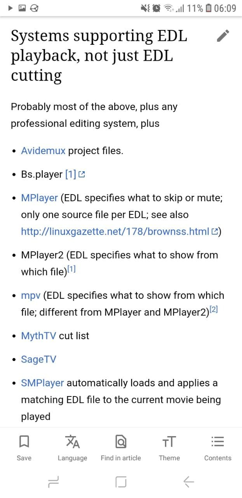
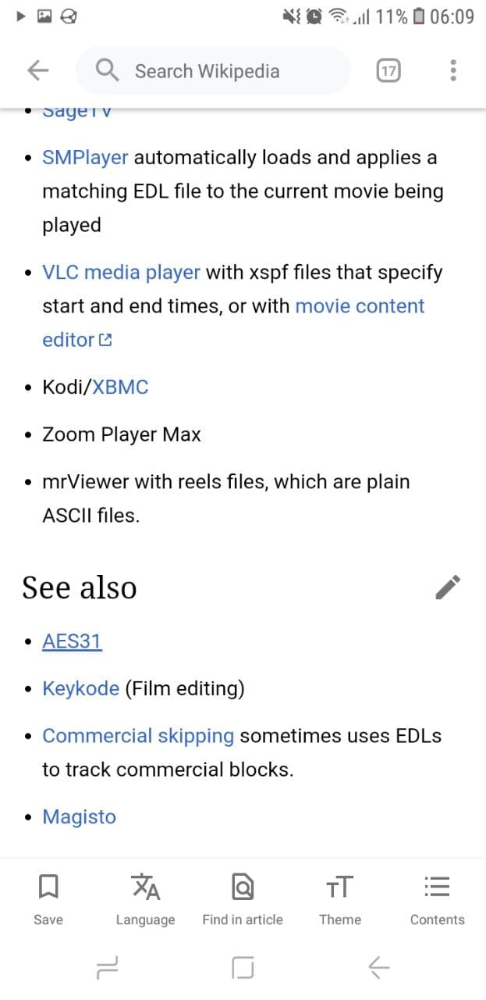
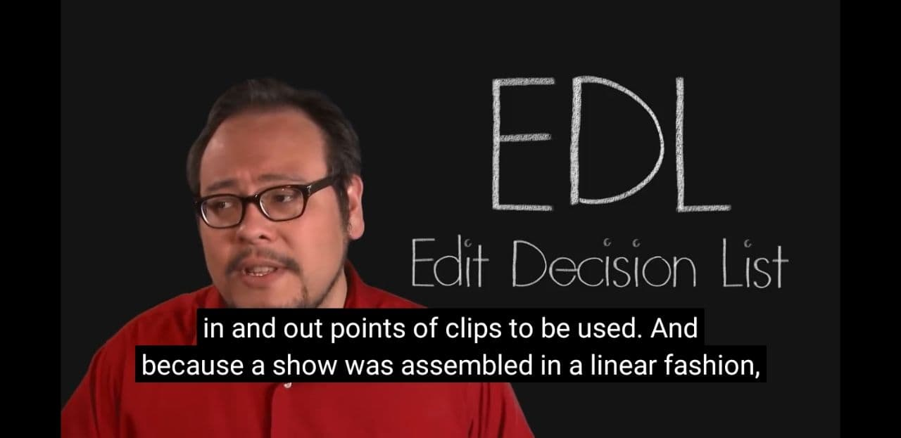
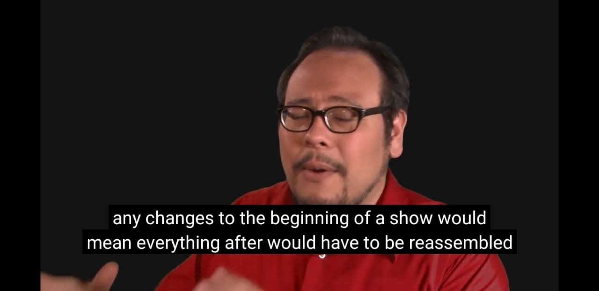
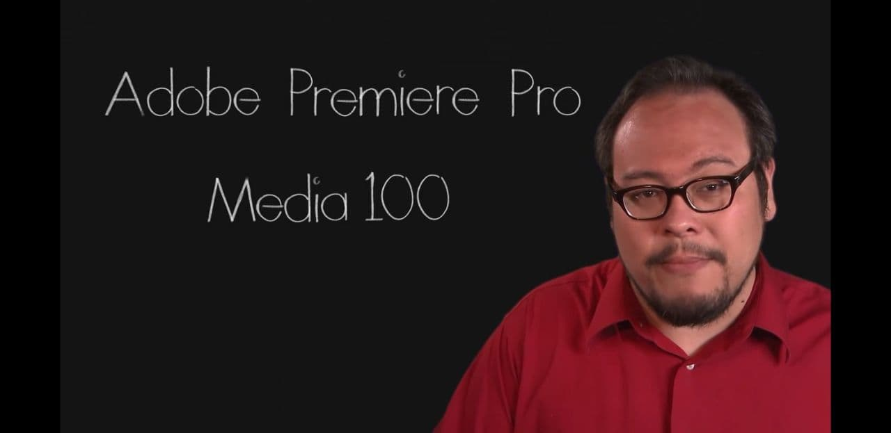
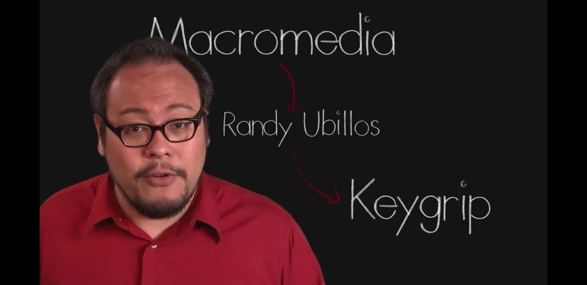
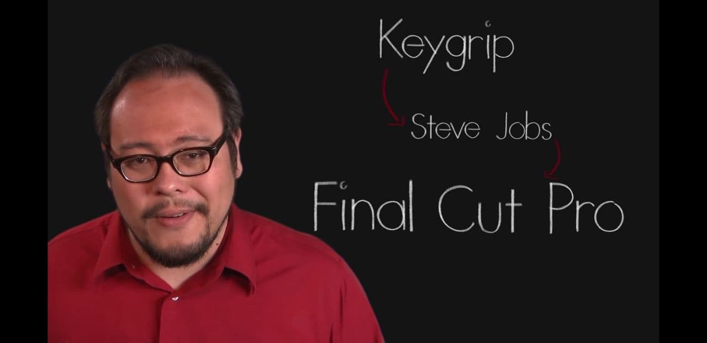
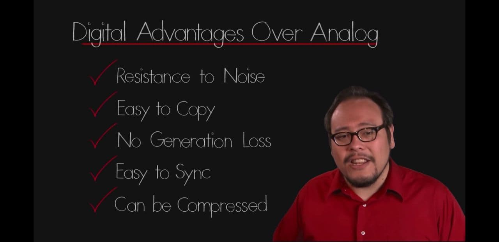
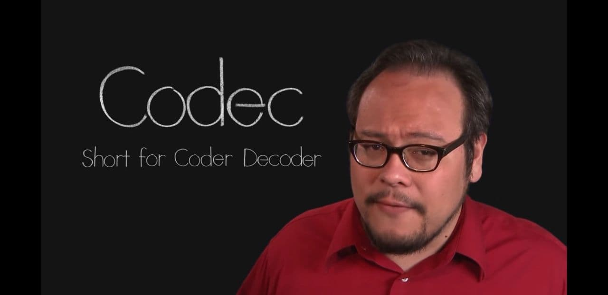
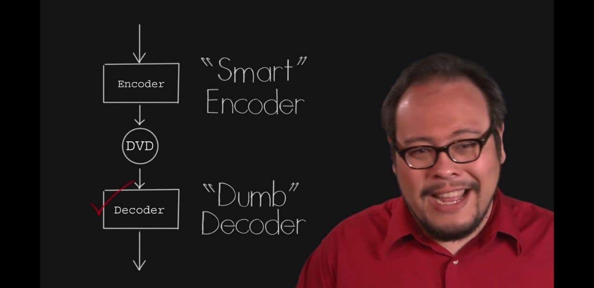

# About video editing

"Systems supporting EDL playback, not just EDL cutting"

## Notes: FilmmakerIQ's "The Journey to Modern Non-Linear Editing"

*Trying to understand nonlinear video editing*

Links:
- [The Journey to Modern Non-Linear Editing (Part 1) | YouTube](https://youtu.be/TIVYeyWHajE)
- [The Journey to Non-Linear Editing (Part 2) | YouTube](https://youtu.be/dhHQw5GrwxU)

Notes:

- [ ] Offline editing same as proxy editing?

- MPEG-2 standardized decoder

- **Avid** is not **AVS Video Editor**, is it? No.

- KAITO: What I did in "Hated by life itself" is make a EDL that FFmpeg used to mark the in and out points for clips and then assembled then in a linear fashion.

-  KAITO: Shotcut is a nonlinear video editing system... I still don't get it ;-;

- [ ] LEARN: What's the difference between Shotcut and Olive?

---

## EDL
#VideoEditing

EDL stands for **Edit decision list**[^W](https://en.wikipedia.org/wiki/Edit_decision_list)

---

END.
