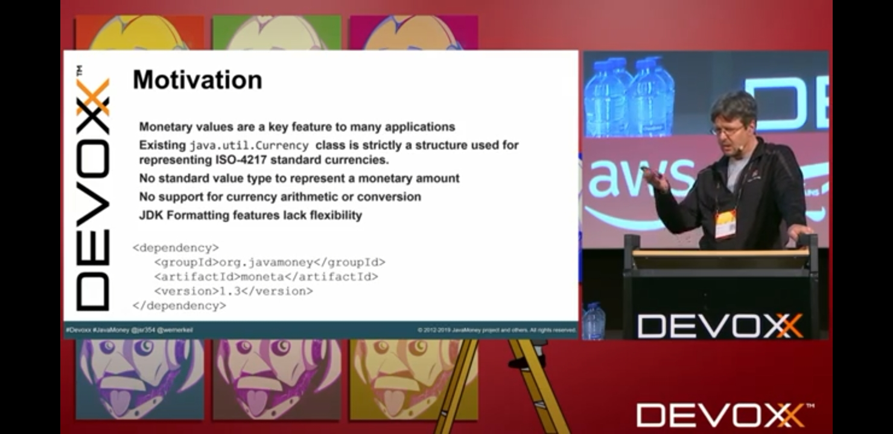
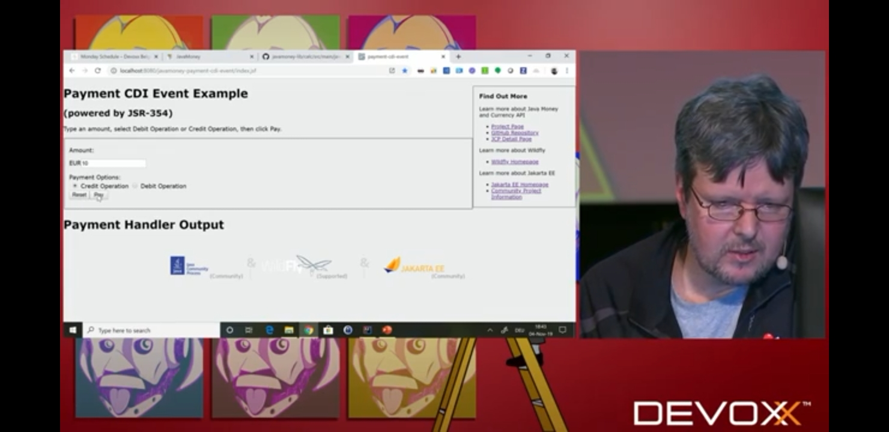
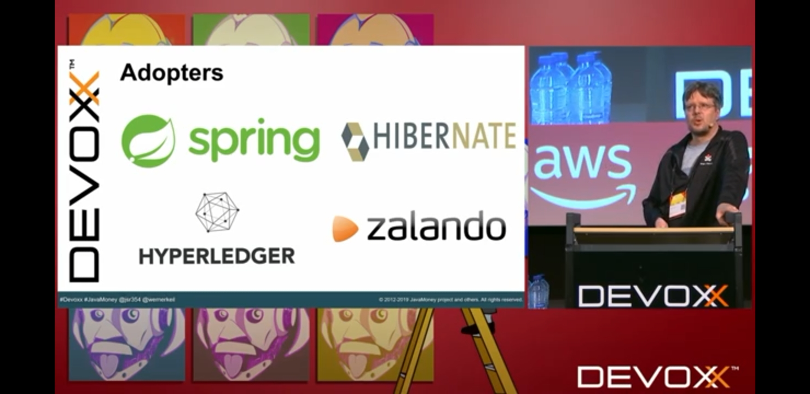
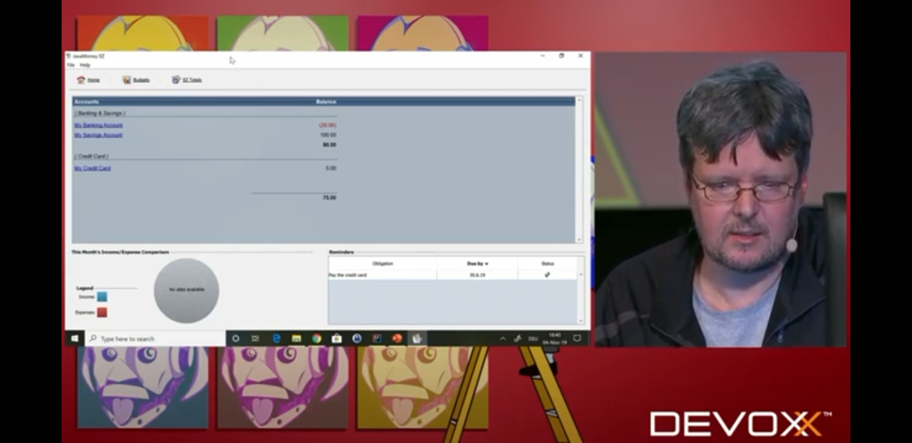

# JavaMoney

JavaMoney API (JSR 354)
javax.money
http://javamoney.github.io

-> https://github.com/zalando/jackson-datatype-money

## NOTES: Money, Money, Money, can be funny with JSR 354 by Werner Keil
https://www.youtube.com/watch?v=heH08CROmb0

You can define your own currencies as in video games, KAITO thinks

You can define your own exchange rates and stuff...

#Financial or #ecommerce related for some project like DigitalLoft

Extension functions in Java?

First UI demo is like a PoC for something like Microsoft Money

The second one in JEE and the used to be called Web Beans

## ISO 4217

https://en.wikipedia.org/wiki/ISO_4217

- Cryptocurrency codes are not standardized in ISO 4217.

- It uses country codes (2-char) + some letter (first letter of the currency, a mnemonic letter, or something that suggests some meaning like "new").

---

END.
