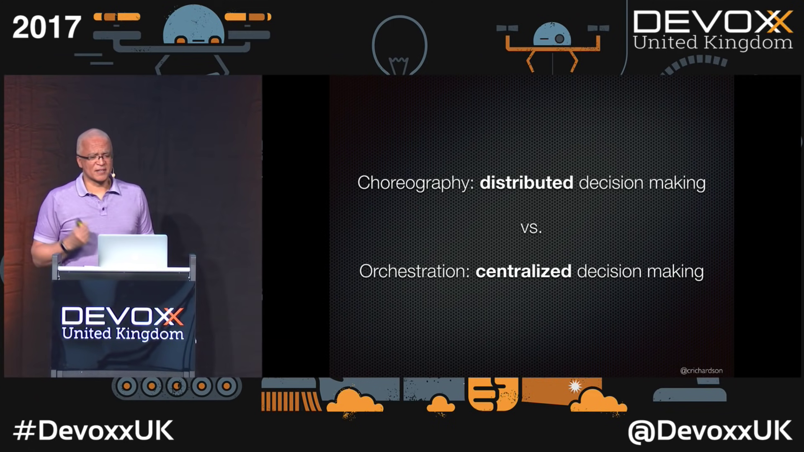
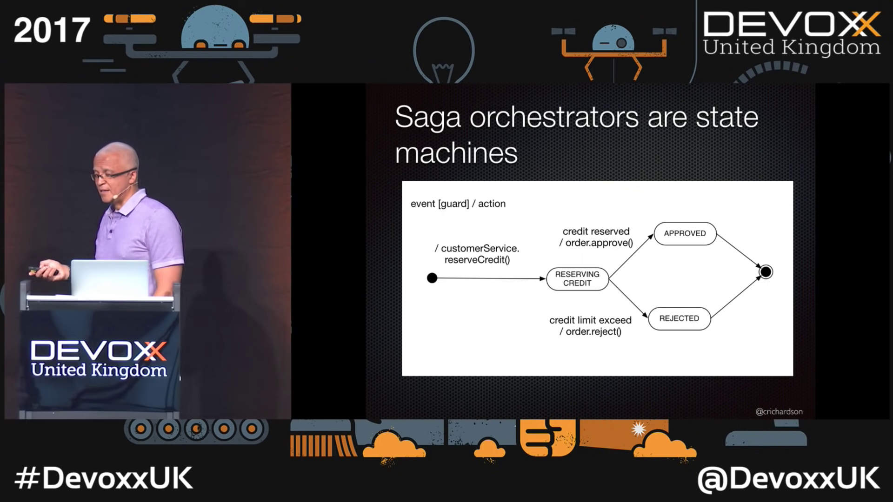

# Microservices

## Patterns

### Saga

- **Using sagas to maintain data consistency in a microservice architecture by Chris Richardson** talk
`[youtube:YPbGW3Fnmbc][opinion:liked]`
    * 
    * 

---

FIN.
