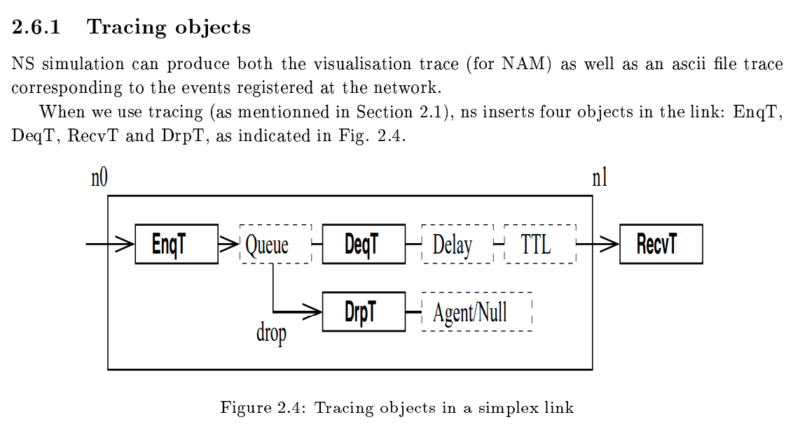
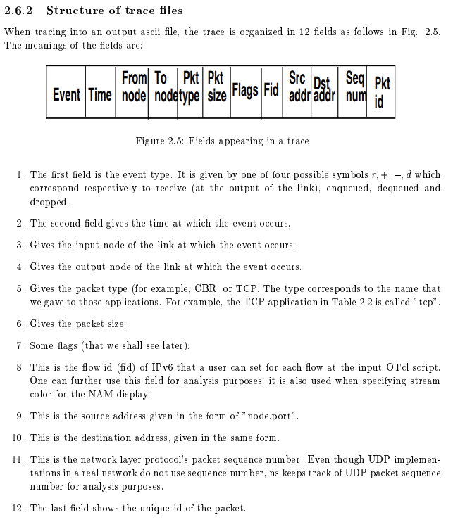

# NS Simulator for beginners 2003 (notes)
#ModuleMESI

saved:`www-sop.inria.fr__Eitan.Altman__COURS-NS__n3.pdf`, can be renamed to `altman2003ns.pdf`

url: https://www-sop.inria.fr/members/Eitan.Altman/COURS-NS/n3.pdf

Citation:
```bibtex
@misc{altman2003ns,
    title = "NS Simulator for beginners",
    author = {Altman, Eitan and Jimenez, Tania},
    note = "Lecture notes, 2003-2004",
    %date = "December 4, 2003",
    year = "2003",
    howpublished = "\url{https://www-sop.inria.fr/members/Eitan.Altman/COURS-NS/n3.pdf}"
}
```

Newer version citation:
```bibtex
% KAITO hasn't read it.
% https://doi.org/10.2200/S00397ED1V01Y201112CNT010
@article{altman2012ns,
  title={NS Simulator for beginners},
  author={Altman, Eitan and Jimenez, Tania},
  journal={Synthesis Lectures on Communication Networks},
  volume={5},
  number={1},
  pages={1--184},
  year={2012},
  publisher={Morgan \& Claypool Publishers}
}
```


## Chapter 1: Introduction

- NS is a discrete event simulator, where the advance of time depends on the timing of events which are maintained by a scheduler. The scheduler keeps an ordered data structure (there are four, but by default ns uses a simple linked list) with the the events to be executed and fires them one by one, invoking the handler of the event.

- Tcl/Otcl language
```tcl
set x [expr 1.0/60/0]

# Open some file for writing
set file1 [open filename w]

# Print a new line to the opened file (KAITO: append?)
puts $file1 "x has value: $x"
```

- See `prime.tcl`
(adapted "Table 1.2: Tcl program for computing prime numbers")

## Chapter 2: ns Simulator Preliminaries

```tcl
set ns [new Simulator]

set tracefile1 [open out.tr w]
$ns trace-all $tracefile1

set namfile [open out.name w]
$ns namtrace-all $namfile
```

```tcl
# To be used to (e.g.) stop the simulation at a moment in time
# As in, `$ns at 125.0 "finish"`
proc finish {} {
    global ns tracefile1 namefile
    $ns flush-trace
    close $tracefile1
    close $namfile
    exec nam out.nam &
    exit 0
}
```

### 2.2 Definition of a network of links and nodes

```tcl
set n0 [$ns node]
set n2 [$ns node]
# Define a bidirectional link between nodes n0 and n1,
#   with capacity of 10Mb/s for each direction, and a 10 ms propagation delay.
# When the link buffer overflows, drop new packages (tail)
$ns duplex-link $n0 $n2 10Mb 10ms DropTail

# Of course, we should define the buffer capacity (think: queue size)
$ns queue-limit $n0 $n2 20
```

### 2.6 Tracing






## Chapter 3: How to work with trace files


### 3.6 Extracting information within a tcl script

```tcl
# Instead of:
#set file1 [open out.tr w]

# We could do something like:
set file1 [open "| grep \"tcp\" > out.tr" w]
```


## Chapter 4: Description and simulation of TCP/IP

```tcl
## Table 4.2: Tcl script ex3.tcl for several competing TCP connections.

#...
```


> To check whether a session has ended, we use the command
`if {[$tcpsrc($i,$j) set ack_]==[$tcpsrc($i,$j) set maxseq_]} {...}`

- "Arrivals of \[TCP] sessions follow a Poisson process."

- "The following procedure is called whenever a connection ends
`Agent/TCP instaproc done {} {...}`". Better approach than iteratively test it as above. See _Table 4.4_.
    * [ ] KAITO/LEARN: We're overriding `Agent/TCP`'s instance method, right?

- Table 4.4
```tcl
## Table 4.4: Tcl script shortTcp2.tcl for short TCP connections

#...
```

- **_Implicit ACK_** is robust under losses of ACKs. Suppose the ACK saying that the destination waits for packet 5, is lost. When the next ACK arrives saying it awaits packet 6, the source knows that the destination has received packet 5, so the information sent by the last ACK is deduced from the next ACK.

## 4.3 TCP over noisy links and queue monitoring
...


## Chapter 5: Routing and network dynamics


---

END.
