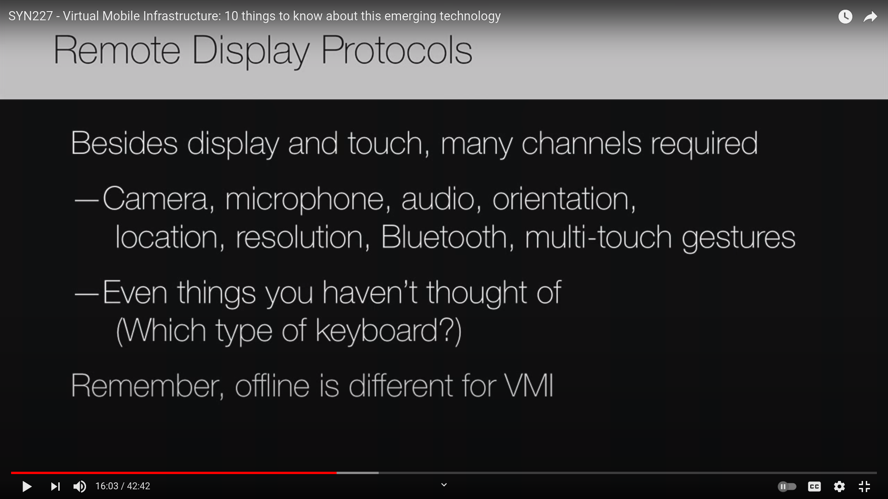
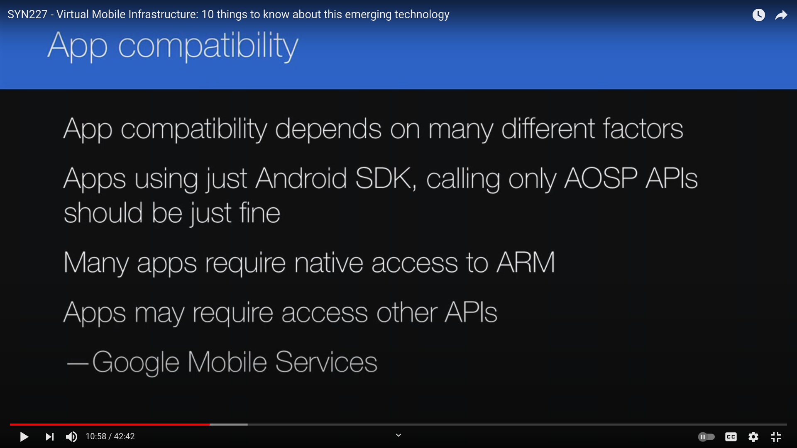

# MVI: 10 things to know about this emerging technology

#Android #Virtualization #talk

[SYN227 - Virtual Mobile Infrastructure: 10 things to know about this emerging technology | Citrix | YouTube](https://www.youtube.com/watch?v=oqHzsOkZ1Hk)
  * By Jack Madden from the TechTarget company

---

Him: "it's like VDI, but with a mobile OS"
VDI: https://en.wikipedia.org/wiki/Desktop_virtualization

\* The OS that's mostly worked on is Android due to Apple's restrictions.

---

"Offline for VMI is different than offline for VDI"
because of our expectations: Desktop is supposed to be usable even when offline, but we've got used to our mobile apps to be completely useless without internet access. Expectations.
KAITO: just because the old thing is shitty, it shouldn't be an argument for keeping the new shit shitty. (Heard this about Bitcoin vs cash flaws, as a far-right means / The Politics of Bitcoin).

---

When?
Do you need a native mobile app? Does it need to be in the data center?
KAITO: Like putting credentials and algorithms and schemas that expose the internal infrastructure inside the app's code to interact with the data servers (or even directly with the database)?

How to run Android?
ARM emulation (QEMU)
X86 versions of Android (Android-x86 counts, right?)
ARM server

---

Remote Display Protocols section:

Bluetooth channel, how to send bluetooth data from the client to the server? (That's a problem.)
KAITO: USB/IP came to mind. Isn't there a thin wrapper for Bluetooth since it works similar to USB 2.0 slave devices?

---

At the end, somebody mentioned the then-upcoming Windows 10 and its RDP capabilities.

---

END.
